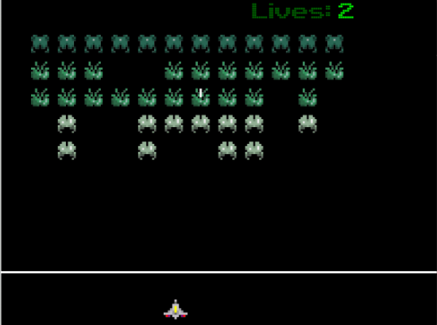

# Space Invaders
 <br />
An adaptation of the Space Invaders arcade game made with python library Kivy.

## Setup
Open terminal and move to the location where the folder will be installed. Run the following command:
```
git clone https://github.com/S3RG101/invaders
```
Move into the folder:
```
cd invaders
```
Install the dependencies with `pip`:
```
pip install -r requirements.txt
```
Return to the directory of the folder:
```
cd ..
```
## Run the game
Make sure to be in the directory where the folder `invaders` is. To run the game, type the following:
```
python invaders
```
To change the number of aliens or the speed of the game, use the optional arguments:
```
python invaders [rows] [columns] [speed]
```
The argument `rows` is an int between 1 and 9 <br />
The argument `columns` is an int between 1 and 15 <br />
The parameter `speed` is a float between 3 (slowest) and 0 (quickest)
